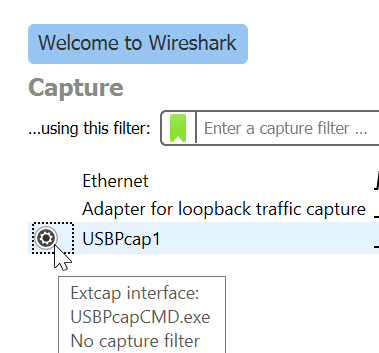
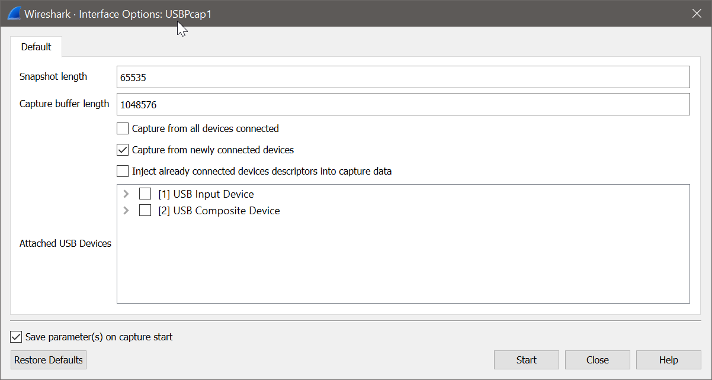
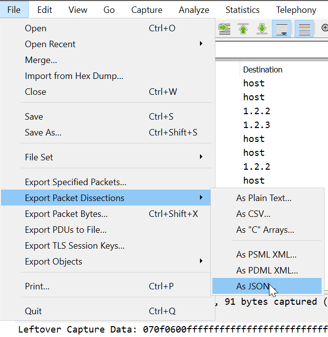

= USB communication dumps
:toc:
:toc-placement!:
:sectnums:
ifdef::env-github[]
:tip-caption: :bulb:
:note-caption: :information_source:
:important-caption: :heavy_exclamation_mark:
:caution-caption: :fire:
:warning-caption: :warning:
endif::[]

All documentation on how to create a dump will go in here.

toc::[]

[#sec-required-software]
== Required Software
As X50Q is only supported to use with Windows, we would need additional software to get this up and running.

* link:https://www.virtualbox.org/wiki/Downloads[VirtualBox] or any similar software
* link:https://www.microsoft.com/de-de/software-download/windows10ISO[Windows 10], as an alternative Windows 7 should also be possible to use.
* link:https://www.wireshark.org/download.html[Wireshark], make sure to install link:https://desowin.org/usbpcap/[USBPcap] during installation of Wireshark

Another really helpful application can be link:https://notepad-plus-plus.org/downloads/[Notepad++] with installed link:https://sourceforge.net/projects/nppjsonviewer/[JSONViewer] plugin to read and compare the exported json dumps.

[#sec-creating-a-dump]
== Creating a dump

To be able to create a dump, all software described in <<sec-required-software>> has to be installed and running.

How to setup the noted software will not be described in this document, as this is a really straight forward task and there are lots of link:https://bfy.tw/OjCO[instructions] out there.

[#sec-configuring-virtualbox]
== Configuring VirtualBox

To be able to change the background color inside the VM we have to bind the keyboard into the VM.

CAUTION: After performing this task the keyboard will no longer work in the host operating system!

To bind the keyboard into the VM the VM has to be up and running. If the VM is started click `Devices -> USB` in the top bar and select the X50Q as shown in the picture <<fig-virtualbox-settings>>.

.Figure 1: VirtualBox settings
[#fig-virtualbox-settings]
image:resources/VirtualBox_settings.png[Bind X50Q to Guest OS]

== Creating a Dump

To create a dump you first have to configure USBPcap. To do so, start up Wireshark and click the gear as shown in <<fig-usbpcap-settings>>.

.Figure 2: USBPcap settings
[#fig-usbpcap-settings]

The window that pops up now lets you choose the correct USB interface. If you do not know which interface to choose the setting of <<fig-usbpcap-recognize-device>> can be used. After that the X50Q has to be deactivated and reactivated  as described in <<sec-configuring-virtualbox>>.

.Figure 3: USBPcap settings
[#fig-usbpcap-recognize-device]

If the correct USB device is known, just tick the correct device and press start. To not get any unexpected signals the tick from "Capture from newly connected devices" should be removed.

After clicking start, Wireshark starts to listen for incoming and outgoing messages of the selected USB interface. You can now perform the steps to create the dump.

IMPORTANT: You should not use the keyboard to navigate through the windows, as all keyboard in- and outputs are added to the dump. So better not ALT+Tabbing to another window :wink:. Additionally the mouse should be moved a little bit to check that not the mouse was attached to the capturing.

When the operation to be dumped has finished the capture can be stopped using the red square in the top bar.

When the color change of a X50Q was captured, the dump should contain 100 packets (or an multiplier of 100) as this is the default size of this kind of communication. It does not matter if there is one or many backlights changed at a time, all keys are reset every time.

[#save-the-dump]
== Save the dump
Saving a dump is the same as saving any other document in any other application.

[#exporting-the-dump]
== Export the dump
It is possible to export the dumps to various formats. The export can be done in the following format:

* Plain Text
* C Arrays
* CSV
* XML
* JSON

As shown in <<fig-wireshark-export-json>> the export can be done choosing `File  -> Export Packet Dissections -> As JSON` directly using Wireshark.

.Figure 4: Export Dump as JSON
[#fig-wireshark-export-json]

Alternatively the dump can be converted via commandline (requires installed tshark). The command shown below will produce the same output than exporting.

[source,bash]
----
tshark -2 -r ../dumps/single_key/left_ctrl_green.pcapng -T json
----

For more information check the command help or link:https://manpages.debian.org/buster/tshark/tshark.1.en.html[manpages] for `tshark`.