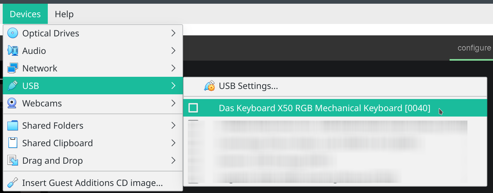

= USB communication dumps
:toc:

[#required_software]
== Required Software
As X50Q is only supported to use with Windows, we would need additional software to get this up and running.

* link:https://www.virtualbox.org/wiki/Downloads[VirtualBox] or any similar software
* link:https://www.microsoft.com/de-de/software-download/windows10ISO[Windows 10], as an alternative Windows 7 should also be possible to use.
* link:https://www.wireshark.org/download.html[Wireshark], make sure to install link:https://desowin.org/usbpcap/[USBPcap] during installation of Wireshark

Another really helpful application can be link:https://notepad-plus-plus.org/downloads/[Notepad++] with installed link:https://sourceforge.net/projects/nppjsonviewer/[JSONViewer] plugin to read and compare the exported json dumps.

== Creating a dump

To be able to create a dump, all software described in <<required_software>> has to be installed and running.

How to setup the noted software will not be described in this document, as this is a really straight forward task and there are lots of link:https://bfy.tw/OjCO[instructions] out there.

== Configuring VirtualBox

To be able to change the background color inside the VM we have to bind the keyboard into the VM.

CAUTION: After performing this task the keyboard will no longer work in the host operating system!

To bind the keyboard into the VM the VM has to be up and running. If the VM is started click `Devices -> USB` in the top bar and select the X50Q as shown in the picture below.

== Creating a Dump

To create a dump you first have to install